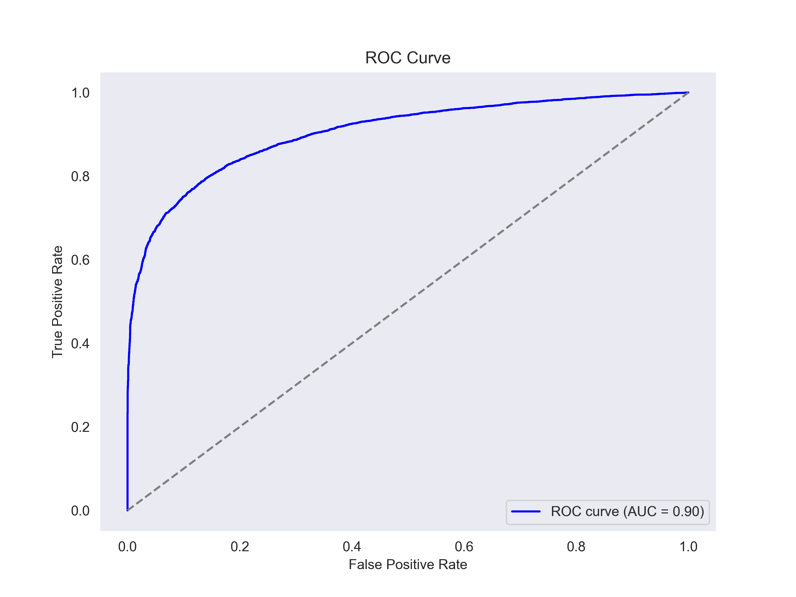
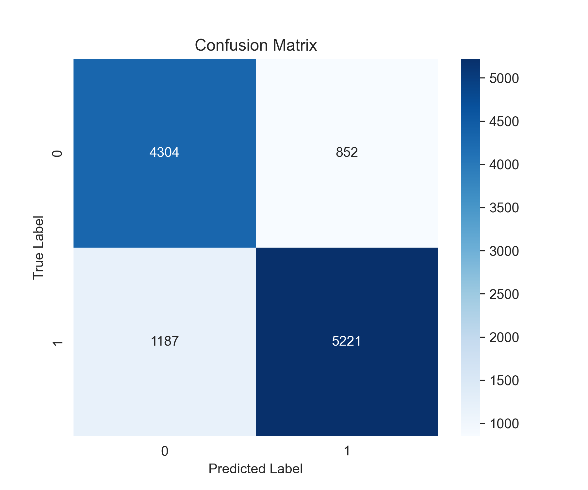
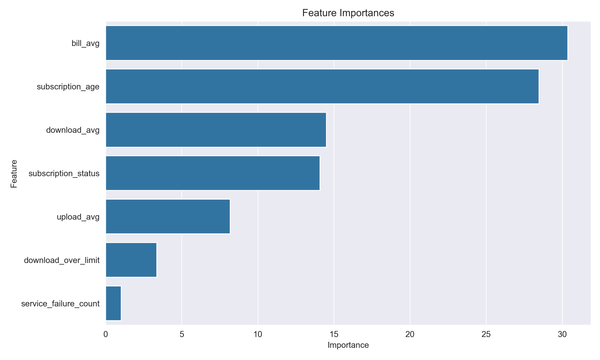

## 인공지능 학습 결과서

### 📊 1. [StandardScaler 적용] 모든 칼럼 포함 모델 성능 비교

| Model               | Precision    | Recall       | F1-score     | Accuracy     | ROC AUC      |
| ------------------- | ------------ | ------------ | ------------ | ------------ | ------------ |
| CatBoost            | **0.946964** | 0.941792     | 0.944371     | 0.938516     | **0.978397** |
| **XGBoost**         | 0.946423     | **0.945537** | **0.945980** | **0.940159** | 0.978164     |
| Random Forest       | 0.946780     | 0.938358     | 0.942550     | 0.936614     | 0.976256     |
| Logistic Regression | 0.849964     | 0.915886     | 0.881695     | 0.863801     | 0.931560     |
| SVM                 | 0.851464     | 0.875780     | 0.863451     | 0.846506     | 0.922671     |

* ✅ 결론: XGBoost가 F1-score, Accuracy, Recall에서 가장 우수하여 종합적으로 가장 성능이 좋은 모델로 판단됨

-------------------------------------------------------------------------------------------------------

### 📊 2. [스케일링 미적용] 모든 칼럼 포함 모델 성능 비교 (동일)

| Model               | Precision    | Recall       | F1-score     | Accuracy     | ROC AUC      |
| ------------------- | ------------ | ------------ | ------------ | ------------ | ------------ |
| CatBoost            | **0.946964** | 0.941792     | 0.944371     | 0.938516     | **0.978397** |
| **XGBoost**         | 0.946423     | **0.945537** | **0.945980** | **0.940159** | 0.978164     |
| Random Forest       | 0.946780     | 0.938358     | 0.942550     | 0.936614     | 0.976256     |
| Logistic Regression | 0.849964     | 0.915886     | 0.881695     | 0.863801     | 0.931560     |
| SVM                 | 0.851464     | 0.875780     | 0.863451     | 0.846506     | 0.922671     |

* ✅ 결론: 스케일링 여부와 관계없이 결과는 동일. 여전히 XGBoost가 최고의 성능을 보임

-------------------------------------------------------------------------------------------------------

### 📊 3. [StandardScaler 적용 + remaining_contract 칼럼 제거]

| Model               | Precision    | Recall       | F1-score     | Accuracy     | ROC AUC      |
| ------------------- | ------------ | ------------ | ------------ | ------------ | ------------ |
| CatBoost            | 0.861735     | **0.819913** | 0.840304     | 0.827309     | **0.905883** |
| **XGBoost**         | **0.864379** | 0.817572     | **0.840324** | **0.827828** | 0.905477     |
| Random Forest       | 0.850670     | 0.802747     | 0.826014     | 0.812608     | 0.890576     |
| SVM                 | 0.801214     | 0.720818     | 0.758893     | 0.746195     | 0.822489     |
| Logistic Regression | 0.728006     | 0.789014     | 0.757283     | 0.719734     | 0.803120     |

* ✅ 결론: remaining_contract 칼럼 제거 시에도 XGBoost가 가장 뛰어난 F1-score와 Accuracy를 보임

-------------------------------------------------------------------------------------------------------

### 📊 4. [스케일링 미적용 + remaining_contract 칼럼 제거]

| Model               | Precision    | Recall       | F1-score     | Accuracy     | ROC AUC      |
| ------------------- | ------------ | ------------ | ------------ | ------------ | ------------ |
| CatBoost            | 0.861735     | **0.819913** | 0.840304     | 0.827309     | **0.905883** |
| **XGBoost**         | **0.864379** | 0.817572     | **0.840324** | **0.827828** | 0.905477     |
| Random Forest       | 0.850670     | 0.802747     | 0.826014     | 0.812608     | 0.890576     |
| SVM                 | 0.801214     | 0.720818     | 0.758893     | 0.746195     | 0.822489     |
| Logistic Regression | 0.728006     | 0.789014     | 0.757283     | 0.719734     | 0.803120     |

* ✅ 결론: 동일하게 XGBoost가 가장 좋은 F1-score, Accuracy를 기록

-------------------------------------------------------------------------------------------------------

### 🏆 Best Model Summary (Grid Search + 다양한 Scaler 테스트)

| Model        | Scaler       | F1-score   | Accuracy   | ROC AUC    | Best Params                                               |
| ------------ | ------------ | ---------- | ---------- | ---------- | --------------------------------------------------------- |
| **CatBoost** | **quantile** | **0.8414** | **0.8285** | **0.9066** | `depth=6`, `iterations=800`, `learning_rate=0.1`          |
| XGBoost      | standard     | 0.8406     | 0.8280     | 0.9051     | `max_depth=10`, `n_estimators=1200`, `learning_rate=0.01` |
| XGBoost      | minmax       | 0.8406     | 0.8280     | 0.9051     | ↑ 동일                                                      |
| XGBoost      | maxabs       | 0.8406     | 0.8280     | 0.9051     | ↑ 동일                                                      |
| XGBoost      | robust       | 0.8406     | 0.8280     | 0.9051     | ↑ 동일                                                      |
| XGBoost      | none         | 0.8406     | 0.8280     | 0.9051     | ↑ 동일                                                      |
| XGBoost      | quantile     | 0.8401     | 0.8272     | 0.9055     | `max_depth=8`, `n_estimators=800`, `learning_rate=0.03`   |
| CatBoost     | standard     | 0.8397     | 0.8267     | 0.9063     | `depth=8`, `iterations=500`, `learning_rate=0.1`          |

* ✅ 결론: 최적의 조합은 CatBoost + Quantile Scaler, 성능 3가지 지표 모두에서 가장 우수

-------------------------------------------------------------------------------------------------------

### 📊 Machin Learning Best Model 시각화

#### ROC Curve

 

#### Confusion Matrix Heatmap

 

#### Feature Importance Plot

-------------------------------------------------------------------------------------------------------

### 🤖 Deep Learning (MLP) 성능

* 다층 퍼셉트론 Multi-Layer Perceptron (MLP) : 은닉층 3 Layer + 출력층 1 Layer (Linear + ReLU)

| Metric    | Score  |
| --------- | ------ |
| F1-score  | 0.7327 |
| Precision | 0.7386 |
| Recall    | 0.7308 |
| Accuracy  | 73.95% |

* ✅ 결론: 전통적인 ML 모델(XGBoost, CatBoost)이 딥러닝 모델(MLP)보다 월등히 높은 성능을 보임

-------------------------------------------------------------------------------------------------------

### 🧠 종합 결론

* 최종적으로 가장 좋은 조합은 CatBoost + Quantile Scaler로, 모든 성능 지표에서 최상위

* remaining_contract 컬럼은 성능 향상에는 기여하지만, 과적합 우려가 있어 제거 후 모델을 선택하는 것이 일반화 측면에서 바람직

* Deep Learning 모델은 MLP 구조 기준에서 ML 기반 모델에 비해 성능이 낮은 편이며, 향후 CNN/RNN 구조나 앙상블 기법 도입이 필요할 수 있음